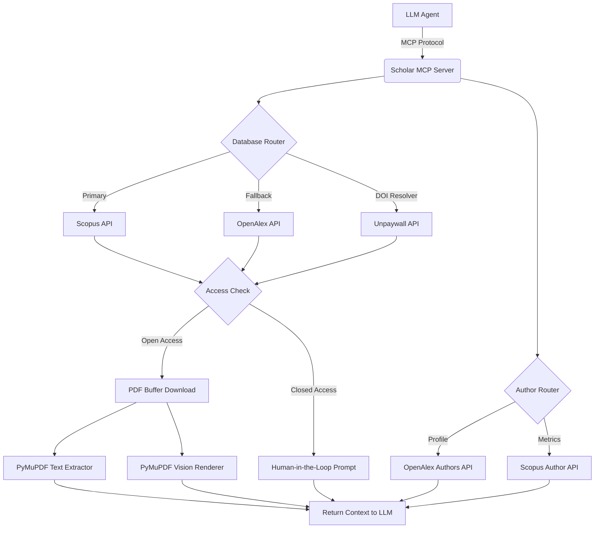

# Scholar MCP Server

[](https://www.python.org/)
[](https://modelcontextprotocol.io/)
[](https://opensource.org/licenses/MIT)

A [Model Context Protocol](https://modelcontextprotocol.io/) (MCP) server that gives AI agents comprehensive access to scientific literature. It acts as middleware between LLMs and academic databases — **Scopus**, **OpenAlex**, and **Unpaywall** — providing automated paper discovery, author analytics, metadata extraction, citation tracking, and multimodal PDF rendering.

## Features

- **Multi-Source Paper Discovery**
  - **Scopus** — Primary metadata engine with support for advanced Boolean syntax (requires API key).
  - **OpenAlex** — Open-access-first search with full abstract reconstruction.
  - **Unpaywall** — Native title search and DOI-to-PDF resolution across global OA repositories.

- **Author Analytics & Disambiguation**
  - Rapid author name autocomplete via OpenAlex for disambiguation.
  - Deep author profiles: h-index, i10-index, ORCID, institutional history, and top research concepts.
  - Scopus Author Retrieval for precise Elsevier-sourced citation metrics.
  - Chronologically sorted publication lists per author.

- **Citation Tracking**
  - Forward citations (who cited this paper) and backward references (who this paper cites) via OpenAlex.

- **Full-Text Extraction**
  - High-fidelity text extraction from OA PDFs using [PyMuPDF](https://pymupdf.readthedocs.io/) with accurate multi-column layout handling.
  - HTML fallback extraction via BeautifulSoup for non-PDF resources.
  - All-in-one DOI → Unpaywall → PDF → text pipeline in a single tool call.

- **Multimodal Vision Rendering**
  - Renders PDF pages as PNG images for direct consumption by Vision-capable LLMs.
  - Ideal for analyzing charts, tables, equations, and layouts that text extraction cannot capture.

- **Graceful Paywall Handling**
  - Injects meta-instructions to the LLM agent requesting manual document uploads when encountering closed-access content.

## Architecture



## Installation

### Prerequisites

- Python 3.10+
- [Elsevier Developer API Key](https://dev.elsevier.com/) (for Scopus features)

### Setup

```bash
# Clone the repository
git clone https://github.com/mlintangmz2765/Scholar-MCP.git
cd Scholar-MCP

# Create and activate virtual environment
python -m venv venv
# Windows
.\venv\Scripts\activate
# Unix/macOS
source venv/bin/activate

# Install dependencies
pip install -r requirements.txt

# Configure environment
cp .env.example .env
```

### Environment Variables

| Variable            | Required | Description                                                       |
|---------------------|----------|-------------------------------------------------------------------|
| `SCOPUS_API_KEY`    | Yes      | Elsevier API key for Scopus search and author retrieval.          |
| `SCOPUS_INST_TOKEN` | No       | Institutional token for full abstract access via Scopus.          |
| `CONTACT_EMAIL`     | Yes      | Email for OpenAlex/Unpaywall polite-pool API routing.             |

## Configuration

Configure your MCP client (Claude Desktop, Cursor, Gemini CLI, etc.) by pointing to the virtual environment Python binary and `server.py`:

```json
{
  "mcpServers": {
    "scholar-mcp": {
      "command": "/absolute/path/to/Scholar-MCP/venv/bin/python",
      "args": [
        "/absolute/path/to/Scholar-MCP/server.py"
      ],
      "env": {
        "SCOPUS_API_KEY": "your_scopus_api_key",
        "SCOPUS_INST_TOKEN": "your_optional_inst_token",
        "CONTACT_EMAIL": "your_email@domain.com"
      }
    }
  }
}
```

> **Note:** On Windows, use `venv/Scripts/python.exe` instead of `venv/bin/python`.

## Tools

The server registers the following tools to the connected MCP client:

### Paper Discovery

| Tool                           | Signature                                                      | Description                                                                                                   |
|--------------------------------|----------------------------------------------------------------|---------------------------------------------------------------------------------------------------------------|
| `search_papers_tool`           | `(query, limit=5, use_scopus=True)`                            | Search papers via Scopus (supports advanced Boolean syntax) or OpenAlex.                                      |
| `get_paper_details_tool`       | `(paper_id)`                                                   | Fetch full metadata and abstract for a paper by Scopus ID or DOI.                                             |
| `search_titles_unpaywall_tool` | `(query, is_oa=None)`                                          | Search Unpaywall's database directly by title. Set `is_oa=True` for strictly OA results.                      |

### Author Analytics

| Tool                              | Signature                          | Description                                                                    |
|-----------------------------------|------------------------------------|--------------------------------------------------------------------------------|
| `autocomplete_authors_tool`       | `(name, limit=5)`                  | Rapidly disambiguate author names and resolve OpenAlex Author IDs.             |
| `search_authors_tool`             | `(name, institution=None, limit=5)`| Deep author profiles: h-index, i10-index, ORCID, affiliations, concepts.       |
| `retrieve_author_works_tool`      | `(author_id, limit=15)`           | Chronologically sorted publications for a given OpenAlex author.               |
| `get_author_profile_scopus_tool`  | `(author_id)`                      | Fetch precise Scopus-sourced h-index, citation counts, and affiliation.        |

### Citation Tracking

| Tool               | Signature                              | Description                                                              |
|--------------------|----------------------------------------|--------------------------------------------------------------------------|
| `get_citations_tool`| `(paper_id, direction="references")`  | Retrieve forward citations or backward references via OpenAlex.          |

### Full-Text & PDF

| Tool                            | Signature               | Description                                                                              |
|---------------------------------|-------------------------|------------------------------------------------------------------------------------------|
| `get_full_text_tool`            | `(url)`                 | Extract text from an OA PDF or HTML page using PyMuPDF.                                  |
| `get_full_text_visual_tool`     | `(url, max_pages=3)`    | Render PDF pages as images for Vision-capable LLMs.                                      |
| `fetch_pdf_text_unpaywall_tool` | `(doi)`                 | All-in-one: resolve DOI via Unpaywall → download PDF → extract text.                     |

### Open Access Resolution

| Tool                    | Signature | Description                                                            |
|-------------------------|-----------|------------------------------------------------------------------------|
| `get_unpaywall_link_tool`| `(doi)`  | Resolve a DOI to all available OA locations via Unpaywall.             |

## Project Structure

```
Scholar-MCP/
├── server.py          # MCP tool definitions and entry point
├── api.py             # HTTP clients for Scopus, OpenAlex, and Unpaywall
├── extractor.py       # PDF/HTML text extraction and visual rendering
├── requirements.txt   # Python dependencies
├── .env.example       # Environment variable template
├── LICENSE            # MIT License
└── README.md
```

## Troubleshooting

| Symptom | Cause | Resolution |
|---------|-------|------------|
| `HTTP 401` from Scopus | Standard API keys lack `META_ABS` view access. | Set `SCOPUS_INST_TOKEN` or use OpenAlex as fallback. |
| `HTTP 403` on PDF download | Publisher anti-bot protection (Cloudflare, DataDome). | Provide the PDF manually to the LLM. |
| Empty Unpaywall results | Paper is behind a strict paywall with no OA copies. | Request the PDF from the author via ResearchGate or institutional access. |
| `SCOPUS_API_KEY is not set` | Missing environment variable. | Ensure `.env` is configured or pass via MCP client `env` block. |

## Contributing

1. Fork the repository.
2. Create a feature branch (`git checkout -b feature/my-feature`).
3. Commit your changes (`git commit -m 'feat: add new capability'`).
4. Push to the branch (`git push origin feature/my-feature`).
5. Open a Pull Request.

Please ensure all code follows PEP 8 conventions.

## License

MIT License. See [LICENSE](LICENSE) for details.

---

> **Disclaimer:** Automated querying of publisher APIs must comply with the respective Terms of Service of Elsevier, OpenAlex, and Unpaywall. Do not distribute API keys. Adhere to all applicable rate limits.
