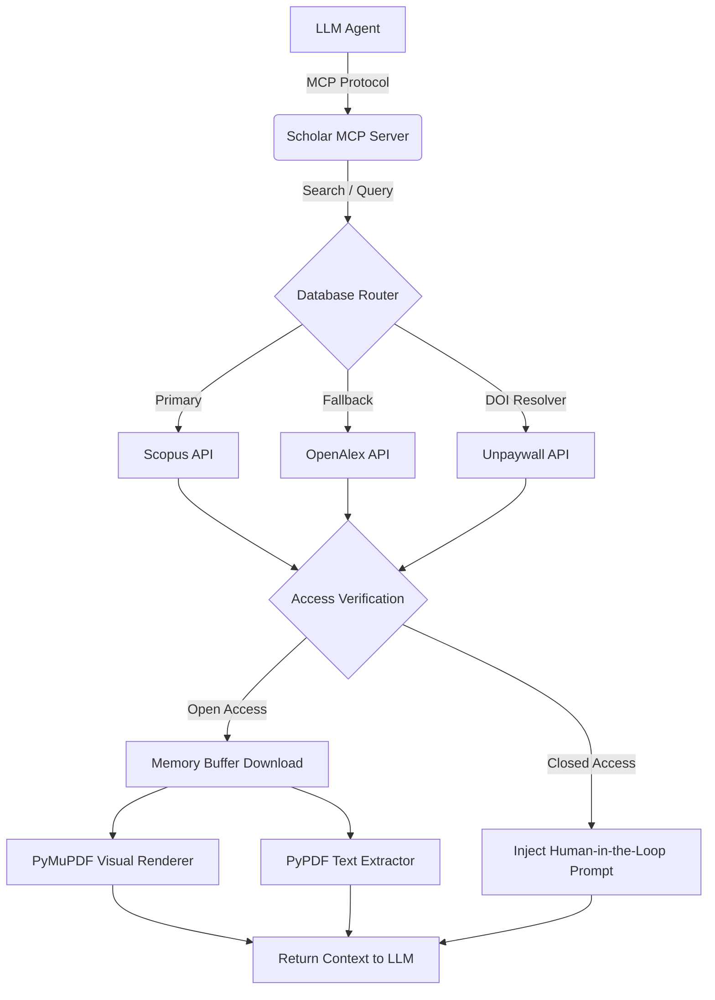

# Scholar MCP Server

[](https://www.python.org/)
[](https://modelcontextprotocol.io/)
[](https://opensource.org/licenses/MIT)

A Model Context Protocol (MCP) server designed to provide Local and Cloud AI agents with comprehensive access to scientific literature. The server acts as a middleware between LLMs and academic databases (Scopus, OpenAlex, Unpaywall), providing automated paper discovery, metadata extraction, and multimodal Open Access (OA) PDF rendering capabilities.

## Features

- **Multi-Source Discovery Pipeline**
  - **Scopus:** Primary metadata retrieval engine (requires API Key).
  - **OpenAlex:** Robust fallback for Open Access routing and deep search parsing.
  - **Unpaywall Integration:** Automated DOI resolution to institutional OA repositories.
- **On-the-Fly Document Extraction**
  - High-speed buffer extraction for unstructured text (`pypdf` / `BeautifulSoup4`).
  - Native Multimodal Vision rendering via `PyMuPDF` (captures charts, tables, and latex logic).
- **Graceful Paywall Degradation**
  - Fallback mechanisms designed for human-in-the-loop workflows. Injects meta-instructions to the LLM agent to request manual document uploads when encountering `401 Unauthorized` responses from proprietary publishers.

## Architecture



## Installation

### Prerequisites
- Python 3.10+
- [Elsevier Developer Portal Account](https://dev.elsevier.com/) (for Scopus allocation)

### Setup

1. **Clone the repository**
```bash
git clone https://github.com/mlintangmz2765/Scholar-MCP.git
cd Scholar-MCP
```

2. **Initialize Environment**
```bash
python -m venv venv
# Windows
.\venv\Scripts\activate
# Unix/macOS
source venv/bin/activate
```

3. **Install Dependencies**
```bash
pip install -r requirements.txt
```

4. **Environment Configuration**
Copy the template and inject your credentials:
```bash
cp .env.example .env
```
Ensure the following variables are defined in `.env`:
- `SCOPUS_API_KEY`: Requisite for basic metadata queries.
- `SCOPUS_INST_TOKEN` *(Optional)*: Required for full abstract retrievals via Scopus.
- `CONTACT_EMAIL`: Required by OpenAlex/Unpaywall for polite-pool API routing.

## Configuration (MCP Clients)

Configure your target MCP Client (e.g., Claude Desktop, Cursor, Gemini CLI) by pointing to the virtual environment binary and the `server.py` entrypoint.

**Example `mcp_config.json`:**
```json
{
  "mcpServers": {
    "scholar-mcp": {
      "command": "/absolute/path/to/Scholar-MCP/venv/bin/python",
      "args": [
        "/absolute/path/to/Scholar-MCP/server.py"
      ],
      "env": {
        "SCOPUS_API_KEY": "your_scopus_api_key_here",
        "SCOPUS_INST_TOKEN": "your_optional_inst_token",
        "CONTACT_EMAIL": "your_email@domain.com"
      }
    }
  }
}
```

## API / Tool Definitions

The server automatically registers the following tools to the connected MCP Client:

| Tool | Signature | Description |
|------|-----------|-------------|
| `search_papers_tool` | `(query: str, limit: int = 5, use_scopus: bool = True)` | Retrieves paper metadata. Supports standard terms or Scopus Advanced Boolean syntax (e.g. `TITLE(...) AND PUBYEAR > YYYY`). Toggle `use_scopus=False` to force OpenAlex lookup. |
| `get_paper_details_tool` | `(paper_id: str)` | Fetches granular metadata, full abstracts, and resolves Open Access status via Scopus. |
| `get_unpaywall_link_tool` | `(doi: str)` | Checks the Unpaywall database using a DOI to locate all free institutional or pre-print PDF paths. |
| `get_citations_tool` | `(paper_id: str, direction: str = "references")` | Tracks lineage. Fetch bibliography (references) or forward citations via OpenAlex natively. |
| `autocomplete_authors_tool` | `(name: str, limit: int = 5)` | Rapidly search OpenAlex to disambiguate and identify the correct Author ID. |
| `search_authors_tool` | `(name: str, institution: str, limit: int = 5)` | Deep search for an author's profile (h-index, concepts, latest affiliations) via OpenAlex. |
| `retrieve_author_works_tool` | `(author_id: str, limit: int = 15)` | Retrieve chronologically sorted publications for an OpenAlex author ID. |
| `get_author_profile_scopus_tool`| `(author_id: str)` | Fetch precise academic metrics (h-index, total citations) from Elsevier Scopus using a Scopus Author ID. |
| `search_titles_unpaywall_tool` | `(query: str, is_oa: bool)` | Natively search Unpaywall's global database via paper titles. Set `is_oa=True` for strictly free papers. |
| `get_full_text_tool` | `(url: str)` | Downloads an Open Access PDF down to unstructured text, accurately preserving layout using `PyMuPDF`. |
| `fetch_pdf_text_unpaywall_tool`| `(doi: str)` | All-in-one bypass: Takes a DOI, resolves best PDF on Unpaywall, and extracts text seamlessly using `PyMuPDF`. |
| `get_full_text_visual_tool`| `(url: str, max_pages: int = 3)` | Streams an OA PDF into a high-fidelity image sequence directly to the AI's Vision pipeline. |

## Development

- **Formatting:** Ensure adherence to PEP-8.
- **Server Reloading:** Use standard FastMCP CLI or your client's restart mechanisms to flush cached endpoints.

## Troubleshooting

- **`HTTP 401 Unauthorized` (Scopus):** Standard developer keys only permit `<view=STANDARD>`. Fetching deep abstracts (`<view=META_ABS>`) requires an institutional token (`SCOPUS_INST_TOKEN`). The server automatically falls back to requesting manual uploads from the user in this scenario.
- **`HTTP 403 Forbidden` (PDF Extraction):** Occurs when target URLs employ strict Cloudflare/Anti-bot logic (e.g., Emerald Insight). Provide the PDF manually to the LLM.

## License

MIT License. See [LICENSE](LICENSE) for details.

*Note: Automated scraping of publisher end-points must adhere to the respective Terms of Service of Elsevier, OpenAlex, and Unpaywall. Do not distribute access keys, and strictly adhere to rate limits.*
